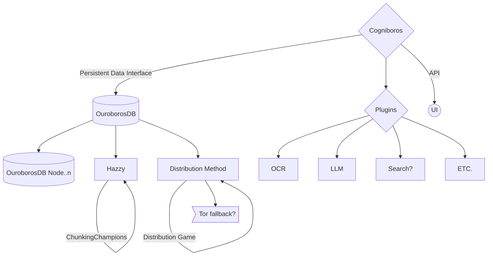

# Cogniboros

Mermaid:

```mermaid
flowchart TD
    A{Cogniboros}
    A -->|Persistent Data Interface| B[(OuroborosDB)]
    B --> B1[(OuroborosDB Node..n)]
    
    B --> D[Hazzy]
    D --> |ChunkingChampions| D

    B --> C[Distribution Method]
    C --> |Distribution Game| C
    C --> E>Tor fallback?]

    A --> F{Plugins}
    F --> OCR
    F --> LLM
    F --> Search?
    F --> ETC.

    A -->|API| G((UI))

```